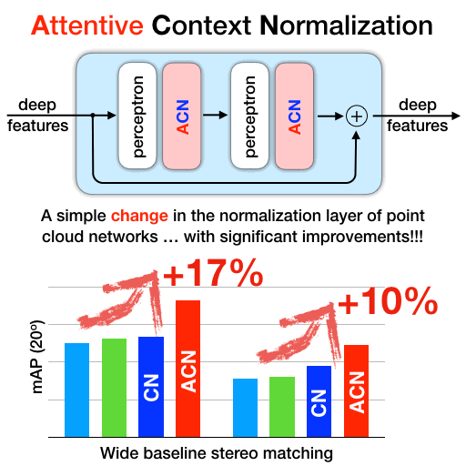

## ACNe: Attentive Context Normalization for Robust Permutation-Equivariant Learning

Proceedings of the IEEE Conference on Computer Vision and Pattern Recognition, 2020.

[Weiwei Sun](https://weiweisun2018.github.io/), [Wei Jiang](https://jiangwei221.github.io/), [Eduard Trulls](http://etrulls.github.io/), [Andrea Tagliasacchi](http://gfx.uvic.ca/people/ataiya), [Kwang Moo Yi](http://vision.uvic.ca/people/kmyi).

[Code](https://github.com/vcg-uvic/acne) &emsp; | &emsp;
[paper](http://openaccess.thecvf.com/content_CVPR_2020/papers/Sun_ACNe_Attentive_Context_Normalization_for_Robust_Permutation-Equivariant_Learning_CVPR_2020_paper.pdf)&emsp; | &emsp;

[Video](https://www.youtube.com/watch?v=c4i_uhTPGTQ)

### Abstraction

Many problems in computer vision require dealing with sparse, unordered data in the form of point clouds. Permutation-equivariant networks have become a popular solution-they operate on individual data points with simple perceptrons and extract contextual information with global pooling. This can be achieved with a simple normalization of the feature maps, a global operation that is unaffected by the order. In this paper, we propose Attentive Context Normalization (ACN), a simple yet effective technique to build permutation-equivariant networks robust to outliers. Specifically, we show how to normalize the feature maps with weights that are estimated within the network, excluding outliers from this normalization. We use this mechanism to leverage two types of attention: local and global-by combining them, our method is able to find the essential data points in high-dimensional space to solve a given task. We demonstrate through extensive experiments that our approach, which we call Attentive Context Networks (ACNe), provides a significant leap in performance compared to the state-of-the-art on camera pose estimation, robust fitting, and point cloud classification under noise and outliers.

### Citations
        @inproceedings{sun2020acne,
          title={Attentive Context Normalization for Robust Permutation-Equivariant Learning},
          author={Weiwei Sun, Wei Jiang, Andrea Tagliasacchi, Eduard Trulls, Kwang Moo Yi},
          booktitle={Proceedings of the IEEE Conference on Computer Vision and Pattern Recognition},
          year={2020},
        }
